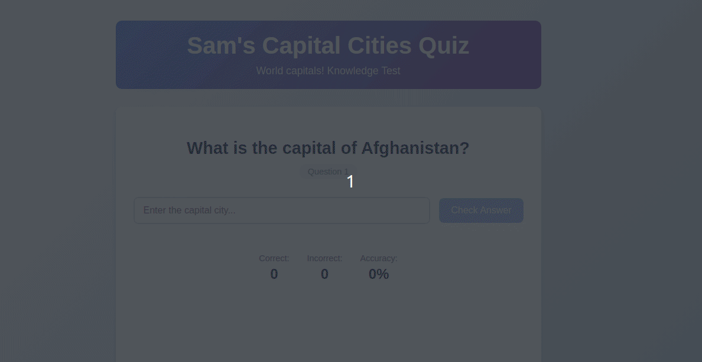

# Capital Cities Quiz Application

A full-stack web application built with Django (backend) and Vue.js (frontend) that tests knowledge of world capital cities. The app fetches country data from an external API and presents random questions to users.

## Demo Preview



## Features

- Random capital city questions from countries worldwide
- Real-time answer checking
- Score tracking with accuracy percentage
- Error handling and loading states

## Tech Stack

**Backend:**
- Django 4.2+
- Django REST Framework
- Django CORS Headers
- Python Requests

**Frontend:**
- Vue.js 3
- Vite (Build Tool)
- Axios (HTTP Client)

## 📁 Project Structure

```
capital-quiz/
├── backend/                 # Django REST API
│   ├── capital_quiz/       # Main Django project
│   ├── quiz/              # Quiz app with models, views, serializers
│   ├── manage.py
│   ├── requirements.txt
│   └── db.sqlite3
├── frontend/               # Vue.js application
│   ├── src/
│   │   ├── components/
│   │   ├── App.vue
│   │   └── main.js
│   ├── package.json
│   └── vite.config.js
└── README.md
```

## 🚀 Local Development Setup

### Prerequisites

Make sure you have the following installed:
- Python 3.8+ 
- Node.js 16+ and npm
- Git

### Step 1: Clone the Repository

```bash
git clone https://github.com/yourusername/capital-quiz.git
cd capital-quiz
```

### Step 2: Backend Setup (Django)

1. **Navigate to backend directory:**
```bash
cd backend
```

2. **Create and activate virtual environment:**

On macOS/Linux:
```bash
python3 -m venv venv
source venv/bin/activate
```

3. **Install Python dependencies:**
```bash
pip install -r requirements.txt
```

4. **Run database migrations:**
```bash
python manage.py makemigrations
python manage.py migrate
```

5. **Start Django development server:**
```bash
python manage.py runserver
```

The backend API will be available at `http://localhost:8000`

### Step 3: Frontend Setup (Vue.js)

1. **Open a new terminal and navigate to frontend directory:**
```bash
cd frontend
```

2. **Install Node.js dependencies:**
```bash
npm install
```

3. **Start development server:**
```bash
npm run dev
```

The frontend will be available at `http://localhost:5173`

### Step 4: Test the Application

1. Open your browser and go to `http://localhost:5173`
2. The app should load and display a random capital city question
3. Try answering questions to test the functionality

## API Endpoints

- `GET /api/question/` - Get a random quiz question
- `POST /api/check-answer/` - Check if answer is correct
- `GET /api/refresh-countries/` - Manually refresh countries data
